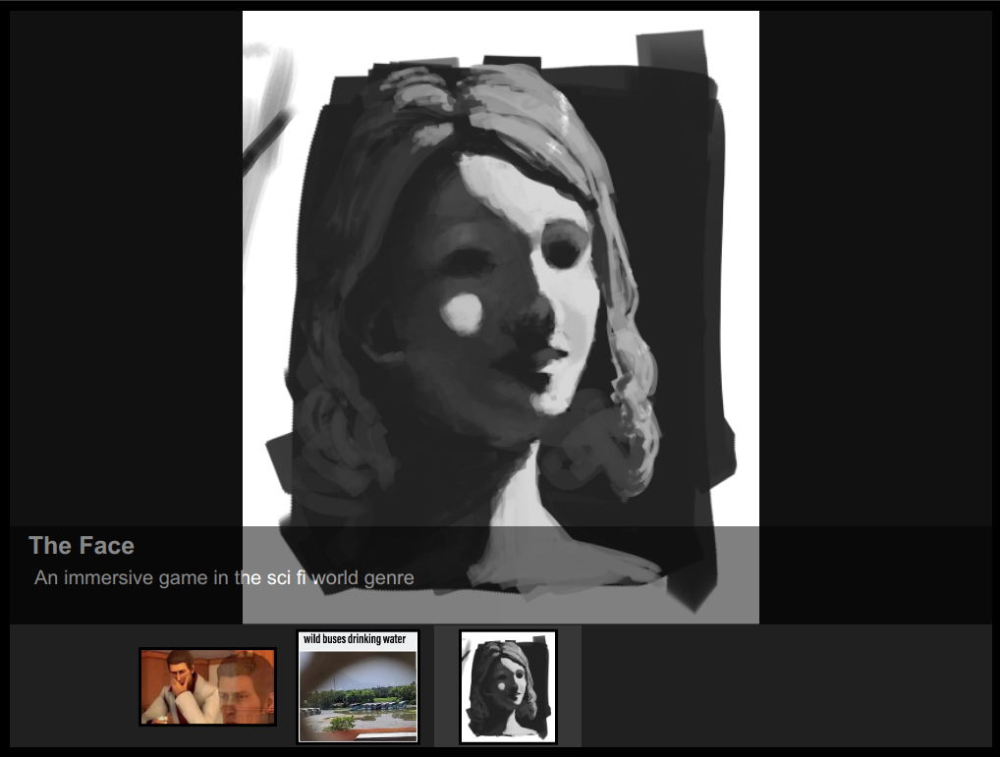
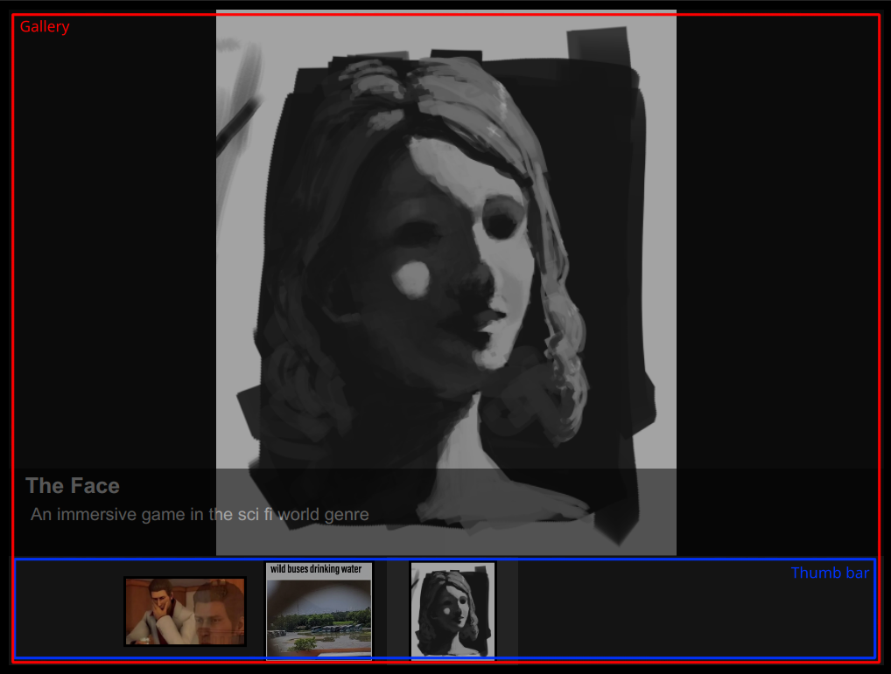

# SmolJSImageGallery

An embeddable and configurable image gallery.

Version 2021.1.2 (First revision)

<br />
<br />



<br />
<br />
<br />

## Features
* Scrollable gallery
* Can insert title and description of an image
* No limitation on how many can be included (beware on resources)
* Smooth animations
* Configurable sizes (viewer and thumb bar)

<br />

## How to embed it on your site
---

### 1. Copy the text into a text editor
Copy the area after `<!--Start copying here--->` until just before `<!--Stop copying here-->`, paste it into a text editor like notepad.

### 2. Edit the size parameters
Your site may have different dimension on how will the post be viewed and how will this image gallery will fit inside the post, so you have to adjust the parameters.

**Which parameters?**

Inside the `<script>` bracket you'll see there are lots of variables assigned like `vwidth = 800;` or `pos = 0;`, what you will be changing is these parameters:

`vwidth` -> Gallery width

`vheight` -> Gallery height

`vswidth` -> Thumb bar images space

`vsheight` -> Thumb bar height



All of those parameters are measured in pixels, remember that the standard DPI is 72, HiDPI scaling (e.g. Retina Displays) will not represent the pixel spacing accurately.

Default parameters are the ones that are already inserted in the code.

### 3. Edit the images inside the gallery
Also inside the `<script>` bracket you'll see there's an area inside the `//!!!------------Edit image resources here------------!!!` comment, there is the space where you can edit what images to be inserted.

What you should focus is this:

```
{
    title:"Think, Think!",
    desc:"This is a test",
    image:"SJImageGallery_Demo_Resource/yakuza-think.jpg"
}
```
That above is the image information, where you can change the title, description, and the image source.

Edit what's inside the qoute, don't remove the quote.

If you have more than 1 image you have to remember to insert the comma, let's look again.

```
image:[
    {
        title:"Think, Think!",
        desc:"This is a test",
        image:"SJImageGallery_Demo_Resource/yakuza-think.jpg"
    }, <-- Put the comma here
    {
        title:"Natural Habitat",
        desc:"This is nature at its finest",
        image:"SJImageGallery_Demo_Resource/bus-drink.jpg"
    }, <-- Put the comma here
    {
        title:"The Face",
        desc:"An immersive game in the sci fi world genre",
        image:"SJImageGallery_Demo_Resource/artistic.png"
    } <-- Don't put the comma here since this is the last of the list.
]
```

### 4. Minify the script and paste it into your website
Copy the edited text inside the `<script>` bracket (from after `<script>` to before `</script>`) from the text editor and paste it into [jscompress.com](https://jscompress.com/) (inside the text box) and then click **Compress Javascript** in the site, copy the text inside the box and replace the text inside the `<script>` bracket with the minified one.

After all that is done all that is left is to copy all the text inside the text editor into your desired site, remember to edit the text in html view, not the visual one (if you're in wordpress).

### Done.